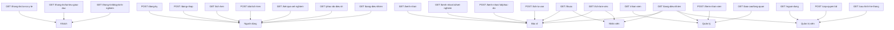

# 📌 Sơ đồ API hệ thống điều trị HIV

```mermaid
graph TD

%% Vai trò người dùng
  guest["Khách"]
  customer["Người dùng"]
  staff["Nhân viên"]
  doctor["Bác sĩ"]
  manager["Quản lý"]
  admin["Quản trị viên"]

%% API công khai
  api1["GET /thong-tin/co-so-y-te"] --> guest
  api2["GET /thong-tin/tai-lieu-giao-duc"] --> guest
  api3["GET /thong-tin/blog-kinh-nghiem"] --> guest

%% API xác thực
  api4["POST /dang-ky"] --> customer
  api5["POST /dang-nhap"] --> customer

%% API người dùng
  api6["GET /lich-hen"] --> customer
  api7["POST /dat-lich-hen"] --> customer
  api8["GET /ket-qua-xet-nghiem"] --> customer
  api9["GET /phac-do-dieu-tri"] --> customer
  api10["GET /bang-dieu-khien"] --> customer

%% API bác sĩ
  api11["GET /benh-nhan"] --> doctor
  api12["GET /benh-nhan/:id/xet-nghiem"] --> doctor
  api13["POST /benh-nhan/:id/phac-do"] --> doctor
  api14["POST /lich-tu-van"] --> doctor

%% API quản lý
  api15["GET /nhan-vien"] --> manager
  api16["POST /them-nhan-vien"] --> manager
  api17["GET /bao-cao/tong-quan"] --> manager

%% API quản trị viên
  api18["GET /nguoi-dung"] --> admin
  api19["POST /cap-quyen/:id"] --> admin
  api20["GET /cau-hinh-he-thong"] --> admin

%% API chung
  api21["GET /bang-dieu-khien"] --> staff
  api21 --> doctor
  api21 --> manager
  api21 --> admin

  api22["GET /thuoc"] --> doctor
  api22 --> staff

  api23["GET /lich-lam-viec"] --> doctor
  api23 --> staff
```
